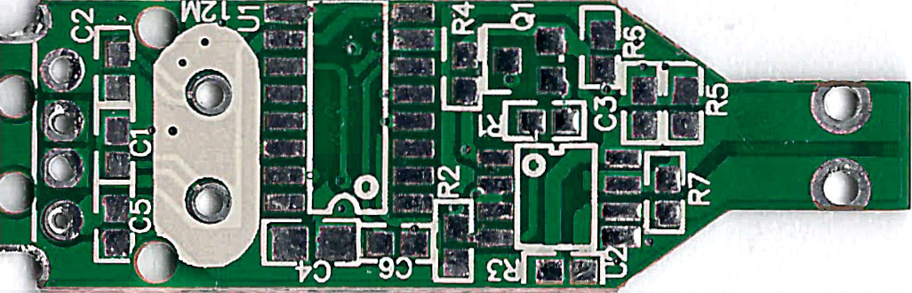
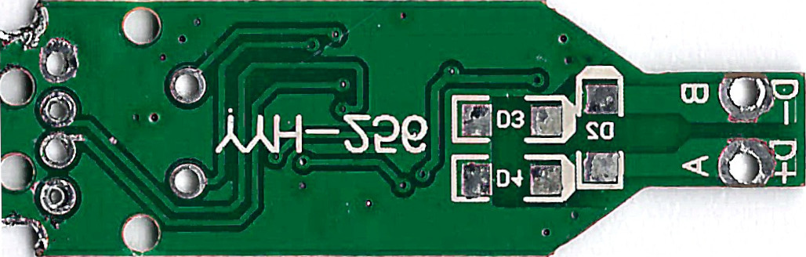

# USB-Modbus reversing <!-- omit in toc -->

Documentation of a reversed no-name USB to Modbus converter. It seems to be using some non-standard automatic `DE/NRE` handling that I would like to use for my [PiPLC project](https://github.com/chrismettal/piplc) for software that can't use manual `DE/NRE` switching, like Home Assistant.

A KiCAD project is included, but only for reversing the original PCB, and not to recreate a new one. Though I might change my mind later.

**If you like my work please consider [supporting me](https://github.com/Chrismettal#donations)!**

## Table of contents <!-- omit in toc -->

- [Original](#original)
- [Reversing](#reversing)
- [Observations](#observations)
- [Donations](#donations)
- [License](#license)

## Original

These cheap thingies are listed as RS485/Modbus CH340 based converters. The "`CH340`" in question is unlabeled on the board and does not seem to be a `CH340` at all.
Interestingly, some parts are not populated. The parts in question seem to be the Crystal for a real CH340 as well as a termination resistor on the Modbus line.

## Reversing

The board was completely depopulated, while the unlabeled parts were being measured. After cleaning the bare boards up, they were scanned with a regular flat bed scanner.

These scans were imported into KiCAD as layer images to trace over. All depopulated parts were created in the Schematic view and placed on the image. Routing without first creating the schematic doesn't work, so we hop back and forth, routing over the image and in the schematic at the same time, until all traces from the image are traced over and all parts are connected.

This let's us end up with the following schematic:

## Observations

- The part that I wanted to see, the automatic `DE/NRE` switching, seems to be super cheap and highly optimistic, switching on the sending driver while `DI` is being pulled `LOW`. This should mean that `A` only sends `LOW` signals actively, while relying on pullups to set `A` back `HIGH`.
- While being so cheap that it doesn't even use active `DE/NRE` switching, the device still has input protection on the `A/B` Modbus lines.
- It also doesn't have the option for a terminating resistor. You could place `R7` manually, but a switch on the side would have been nice.
- The "`CH340`" as described on Amazon is almost certainly not a `CH340`.
- The unpopulated Crystal has lines going to Vias that just don't go anywhere. It looks like the board was originally designed for an actual `CH340` with a crystal, but was quietly modified to accept a different USB converter. Seeing that the crystal's traces just end on a via I assume that they just didn't bother cleaning the rest of the board up when the converter IC was changed.

## Donations

**If you like my work please consider [supporting me](https://github.com/Chrismettal#donations)!**

## License

  This work is licensed under a <a rel="license" href="http://creativecommons.org/licenses/by-sa/4.0/">Creative Commons Attribution-ShareAlike 4.0 International License</a>.
